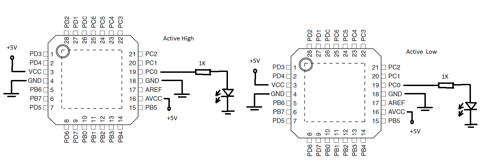
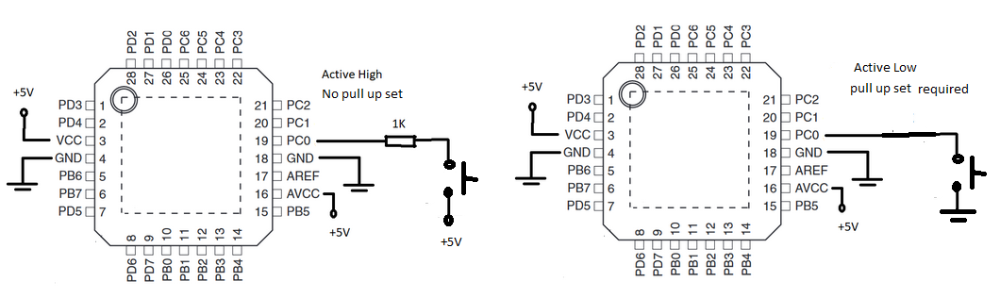
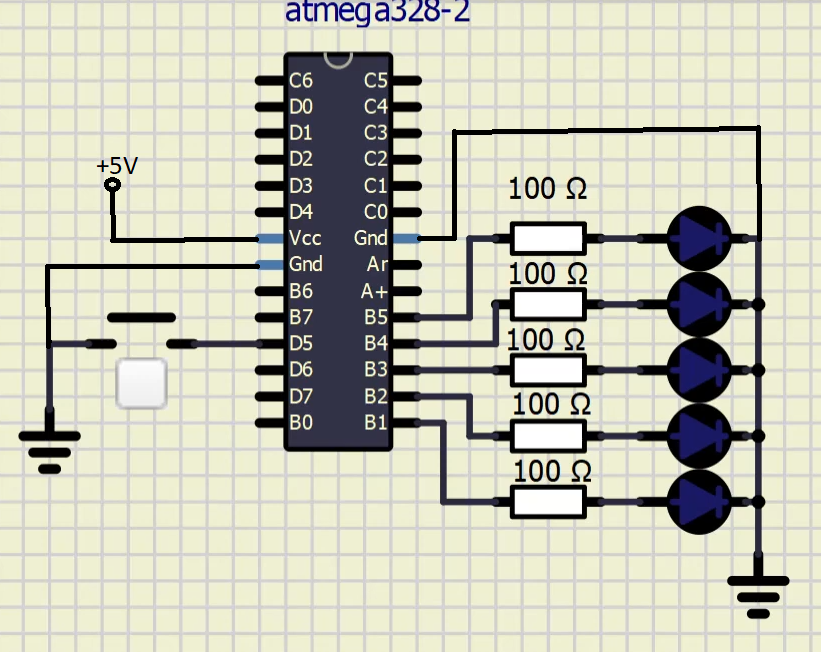

# Lab 2: YOUR_FIRSTNAME FAMILYNAME

Link to your `Digital-electronics-2` GitHub repository:

   [https://github.com/VojtechNiederle/Digital-electronics-2](https://github.com/VojtechNiederle/Digital-electronics-2)


### Active-low and active-high LEDs


### Výpočet led rezistorů

[Červená LED dioda](https://www.gme.cz/led-5mm-red-2-50-hlmp-4700)

[Modrá LED dioda](https://www.gme.cz/led-5mm-blue-460-60-diff)

&nbsp;

| **LED color** | **Supply voltage** | **LED current** | **LED voltage** | **Resistor value** |
| :-: | :-: | :-: | :-: | :-: |
| red | 5&nbsp;V | 2&nbsp;mA | 1.7 | 1650 |
| blue | 5&nbsp;V | 20&nbsp;mA | 3.2 | 90 |
1. Complete tables according to the AVR manual.

| **DDRB** | **Description** |
| :-: | :-- |
| 0 | Input pin |
| 1 | Output pin |

| **PORTB** | **Description** |
| :-: | :-- |
| 0 | Output low value |
| 1 | Output high value |

| **DDRB** | **PORTB** | **Direction** | **Internal pull-up resistor** | **Description** |
| :-: | :-: | :-: | :-: | :-- |
| 0 | 0 | input | no | Tri-state, high-impedance |
| 0 | 1 | input | yes | Pxn will source current if ext. pulled low |
| 1 | 0 | output | no | Output Low (Sink) |
| 1 | 1 | output | no | Output High (Source) |

| **Port** | **Pin** | **Input/output usage?** |
| :-: | :-: | :-- |
| A | x | Microcontroller ATmega328P does not contain port A |
| B | 0 | Yes (Arduino pin 8) |
|   | 1 | ~9 |
|   | 2 | ~10 |
|   | 3 | ~11 |
|   | 4 | 12 |
|   | 5 | 13 |
| C | 0 | Yes (Arduino pin A0) |
|   | 1 | A1 |
|   | 2 | A2 |
|   | 3 | A3 |
|   | 4 | A4 |
|   | 5 | A5 |
| D | 0 | Yes (Arduino pin RX<-0) |
|   | 1 | TX -> 1 |
|   | 2 | 2 |
|   | 3 | ~3 |
|   | 4 | 4 |
|   | 5 | ~5 |
|   | 6 | ~6 |
|   | 7 | 7 |


2. Part of the C code listing with syntax highlighting, which blinks alternately with a pair of LEDs; let one LED is connected to port B and the other to port C:

```c
#define LED_GREEN   PC0
#define LED_2   PB5      // AVR pin where green LED is connected
#define BLINK_DELAY 500
#ifndef F_CPU
# define F_CPU 16000000     // CPU frequency in Hz required for delay
#endif

#include <util/delay.h>     // Functions for busy-wait delay loops
#include <avr/io.h>         // AVR device-specific IO definitions

int main(void)
{

    DDRC = DDRC | (1<<LED_GREEN);
    PORTC = PORTC & ~(1<<LED_GREEN);
    
    DDRB = DDRB | (1<<LED_2);
    PORTB = PORTB & ~(1<<LED_2);

    while (1)
    {
        _delay_ms(BLINK_DELAY);
        PORTC = PORTC ^ (1<<LED_GREEN);
        PORTB = PORTB ^ (1<<LED_2);
    }

    return 0;
}
```


### Push button

1. Part of the C code listing with syntax highlighting, which toggles LEDs only if push button is pressed. Otherwise, the value of the LEDs does not change. Let the push button is connected to port D:

```c
#define LED_GREEN   PB5
#define LED_RED   PB4
#define BUTTON  PD5
#define BLINK_DELAY 500
#ifndef F_CPU
# define F_CPU 16000000
#endif

#include <util/delay.h>
#include <avr/io.h>

int main(void)
{
    DDRB = DDRB | (1<<LED_GREEN);
	DDRB = DDRB | (1<<LED_RED);
	DDRD = DDRD & ~(1<<BUTTON);
    PORTB = PORTB & ~(1<<LED_GREEN);
	PORTB = PORTB | (1<<LED_RED);
	PORTD = PORTD | (1<<BUTTON);

    while (1)
    {
        if (((PIND >> BUTTON) & 1) == 0)
		{
			PORTB = PORTB ^ (1<<LED_GREEN);
		}
	_delay_ms(BLINK_DELAY);
	if (((PIND >> BUTTON) & 1) == 0)
		{
			PORTB = PORTB ^ (1<<LED_RED);
		}
    }
    return 0;
}
```


### Knight Rider

1. Scheme of Knight Rider application, i.e. connection of AVR device, five LEDs, resistors, one push button, and supply voltage. The image can be drawn on a computer or by hand. Always name all components and their values!


#### Code: 
```c
#define LED_1   PB5
#define LED_2   PB4
#define LED_3   PB3
#define LED_4   PB2
#define LED_5   PB1
#define BUTTON  PD5
#define BLINK_DELAY 250
#ifndef F_CPU
# define F_CPU 16000000
#endif

#include <util/delay.h>
#include <avr/io.h>
#include <stdlib.h>

int main(void)
{
        DDRB = DDRB | (1<<LED_1);
	DDRB = DDRB | (1<<LED_2);
	DDRB = DDRB | (1<<LED_3);
	DDRB = DDRB | (1<<LED_4);
	DDRB = DDRB | (1<<LED_5);
	DDRD = DDRD & ~(1<<BUTTON);
	
	
        PORTB = PORTB & ~(1<<LED_1);
	PORTB = PORTB & ~(1<<LED_2);
	PORTB = PORTB & ~(1<<LED_3);
	PORTB = PORTB & ~(1<<LED_4);
	PORTB = PORTB & ~(1<<LED_5);
	PORTD = PORTD | (1<<BUTTON);

	int LED_on = 0;
	int Button_Relased = 1;
	void BUTTON_PRESSED ( )
	{
		if (Button_Relased == 1)
		{
			if (((PIND >> BUTTON) & 1) == 0)
			{
				LED_on = abs(LED_on - 1);
				Button_Relased = 0;
			}
		}
		else
		{
			if (((PIND >> BUTTON) & 1) != 0)
			{
				Button_Relased = 1;
			}
		}
	}

        while (1)
        {
		BUTTON_PRESSED ();
		if (LED_on == 1)
		{
		BUTTON_PRESSED ();
		PORTB = PORTB ^ (1<<LED_1);
		_delay_ms(BLINK_DELAY);
		BUTTON_PRESSED ();
		PORTB = PORTB ^ (1<<LED_1);
		PORTB = PORTB ^ (1<<LED_2);
		_delay_ms(BLINK_DELAY);
		BUTTON_PRESSED ();
		PORTB = PORTB ^ (1<<LED_2);
		PORTB = PORTB ^ (1<<LED_3);
		_delay_ms(BLINK_DELAY);
		BUTTON_PRESSED ();
		PORTB = PORTB ^ (1<<LED_3);
		PORTB = PORTB ^ (1<<LED_4);
		_delay_ms(BLINK_DELAY);
		BUTTON_PRESSED ();
		PORTB = PORTB ^ (1<<LED_4);
		PORTB = PORTB ^ (1<<LED_5);
		_delay_ms(BLINK_DELAY);
		BUTTON_PRESSED ();
		PORTB = PORTB ^ (1<<LED_5);
		PORTB = PORTB ^ (1<<LED_4);
		_delay_ms(BLINK_DELAY);
		BUTTON_PRESSED ();
		PORTB = PORTB ^ (1<<LED_4);
		PORTB = PORTB ^ (1<<LED_3);
		_delay_ms(BLINK_DELAY);
		BUTTON_PRESSED ();
		PORTB = PORTB ^ (1<<LED_3);
		PORTB = PORTB ^ (1<<LED_2);
		_delay_ms(BLINK_DELAY);
		BUTTON_PRESSED ();
		PORTB = PORTB ^ (1<<LED_2);
		}
        }
        return 0;
}

```
#### Video: 
[](https://www.youtube.com/watch?v=pRyABV7619A)
